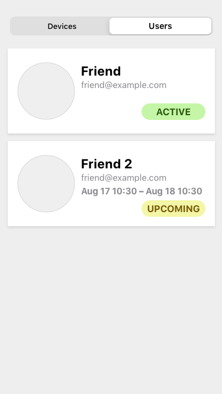

# Frontend Engineer Code Exercise

# Terminology

- _Device_: A WiFi-enabled lock, connected to the Internet, which can be viewed
  and controlled via the app UI.
- _Access User_: A person who can permanently access doors which are protected
  with a smart lock. Each user has their own PIN which can be entered via the
  lock's keypad to unlock it.
- _Access Guest_: A person who can access doors protected with a smart lock for
  a certain date and time range.
- _Access Person_: An access user or guest.

# Exercise

In the `mobile/` directory you'll find an incomplete mobile application. The
task is to extend the code in that directory. The finished application should
have two screens, User and Devices, similar to these mockups:

**Additionally**, the devices screen should also include a **search box** to filter the devices
by name.

The code in the repository is unfinished, feel free to refactor/reorganize it as
you see fit.

# API

The app should fetch the data from an static API served by a local HTTP server.

To start the server run `node api_server.js`.

This server will expose two endpoints:

- Users: http://localhost:4000/api/users

- Devices: http://localhost:4000/api/devices

Additionally those endpoints support filtering by some attributes. The devices
endpoint support filtering name and the users one by status. To filter the
endpoint you need to pass the filter as a query param. ej. To filter the devices
whose name contain the string ome you would use the following URL:
`http://localhost:4000/api/devices?name=ome`.

Remember that when running on the device you may need some [additional configuration][running-on-device]

# What's Important

The goal of this challenge is to show familiarity with frontend
development concepts and ecosystem as well as good general programming
patterns. As such, we feel the following are important:

- Clarity/Readability: Is the intent of the code obvious? Are things named
  appropriately? Please void overly clever solutions.
- Maintainability: How flexible is the code?
- The UI is organized in terms of components
- Responsive design. The application should adapt to different screen sizes.
- The toggle in the device tile should work and maintain the state and cause
  other details in the tile to update.
- The body of the pull request gives a high level overview of your solution

# Bonus points

- The submission includes unit or integration tests

# What's Not Important

- Pixel-perfect design. Remember, these are just mock-ups. Feel free to
  customize the look and feel to your own taste.
- Choice of CSS methodology, library or framework. You can use whatever you are
  familiar with. CSS Modules, Sass or any CSS-in-JS library are accepted.
- Feel free to reach to any UI component or utility library to get the job done.
  No need to re-invent the wheel. Although for trivial stuff, you should feel
  comfortable writing the code yourself.
- Typed vs untyped JS (Flow, TypeScript and plain JS are all accepted)

# How to Submit the Exercise

- Fork the repository
- Create a new branch to work on.
- Push the branch to your fork and open a Pull Request to *your* fork.
- When your Pull Request is ready for review, respond to our last email thread
  with the link to your Pull Request.

[running-on-device]: https://reactnative.dev/docs/running-on-device
